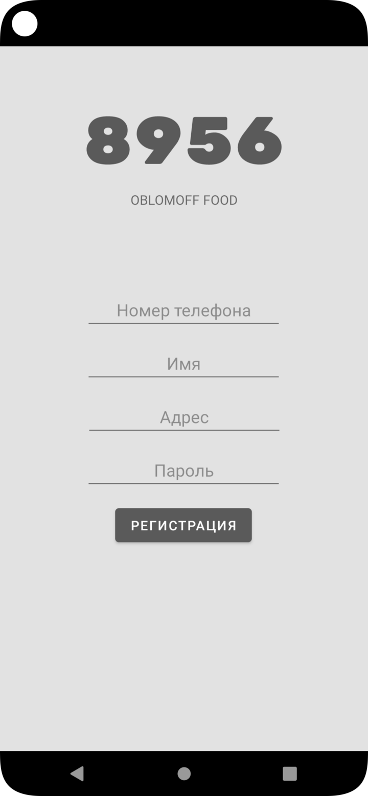
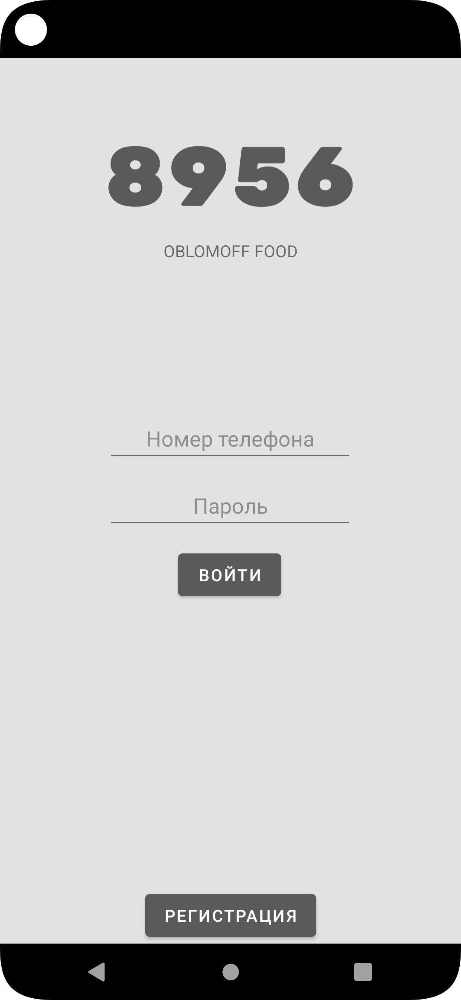
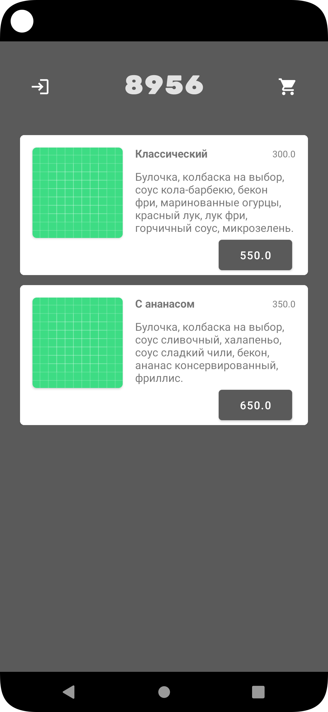
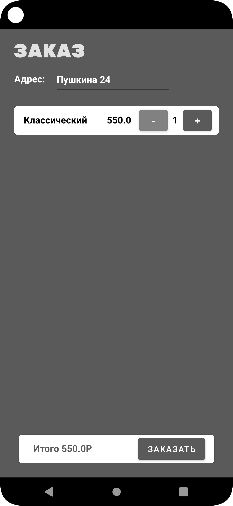
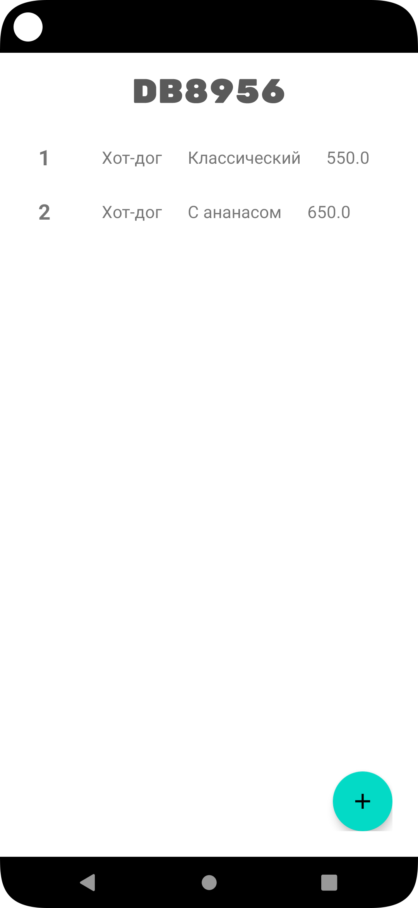
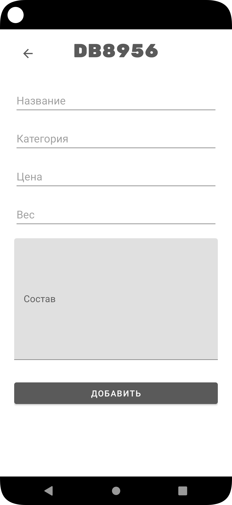
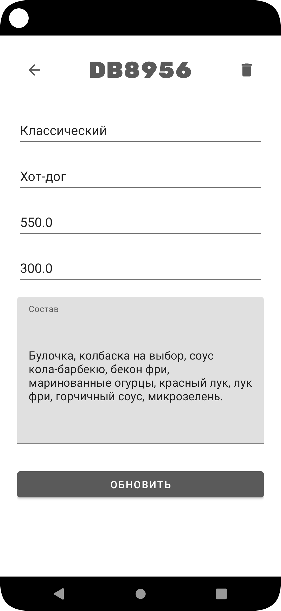

# Delivery App
В рамках учебной задачи было создано мобильное приложение доставки еды.

### [Скрины](#screen)
### [Технологии проекта](#tech)

### Регистрация пользователя

### Авторизация

### Каталог

### Корзина

### Управление базой данных с аккаунта админа

### Технологии проекта
#### Kotlin
#### Room database
